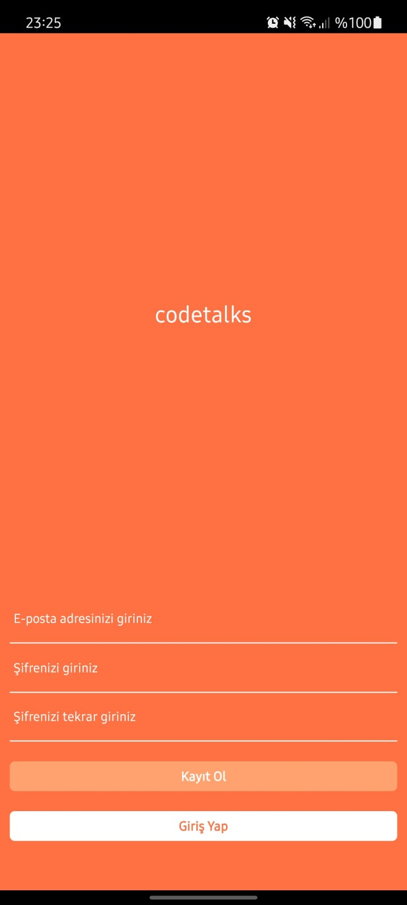
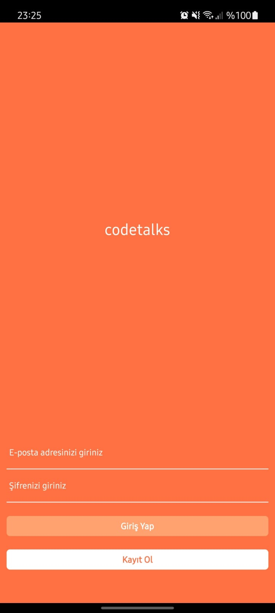
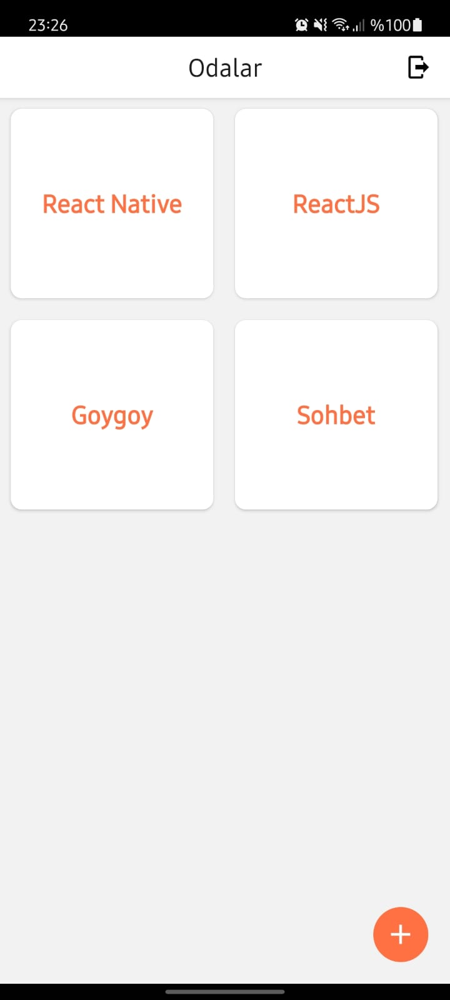
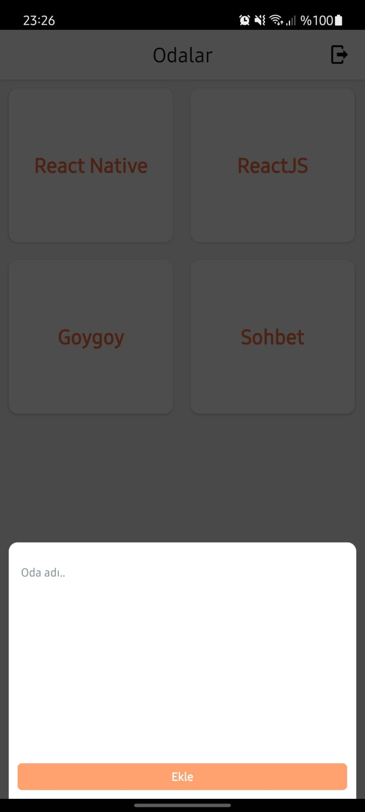
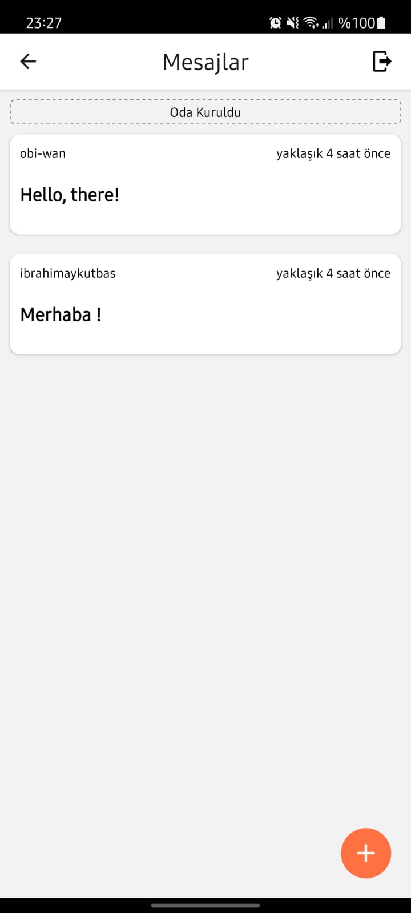
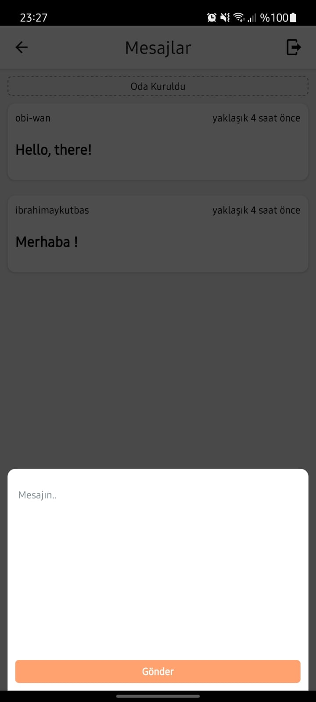

# Bana Ne?

     

## Teknoloji

React Native

## Tools

- Firebase
- React Navigation
- Formik
- React Native Flash Message
- React Native Modal
- React Native Vector Icons

## Özellikler

- Kayıt formu ile sisteme üye olabilmek.
- Kayıt olunan bilgiler ile sisteme giriş yapabilmek.
- Sohbet odasını oluşturabilmek.
- Oluşturulan odalarda sohbet edebilmek.

## Kurulum

Bu depoyu yerel makinenizde klonlayın.

```
git clone https://github.com/ibrahimaykutbas/CodeTalks.git
```

### Hazırlık

Projeyi klonladıktan sonra ilgili dizine gidin.

```
cd CodeTalks
code .
```

Proje bağımlılıklarını yüklemek için proje dizininde aşağıdaki komutları çalıştırın.

```
npm install
-veya-
yarn
```

Eğer macOS kullanıyorsanız ve iOS işletim sistemine sahip bir cihazda projeyi başlatacaksanız pod'ları yükleyin.

```
cd ios
pod install
```

### Kullanım

Projeyi başlatmak için aşağıdaki komutları kullanın.

```
npx react-native run-android
-veya-
npx react-native run-ios
```

Bu talimatlar, geliştirme ve test amacıyla yerel makinenizde projenin bir kopyasını hazır ve çalışır hale getirecektir.

## Daha Fazla Bilgi İçin

Daha fazlasını şuradan öğrenebilirsiniz: [React documentation](https://reactnative.dev/)
